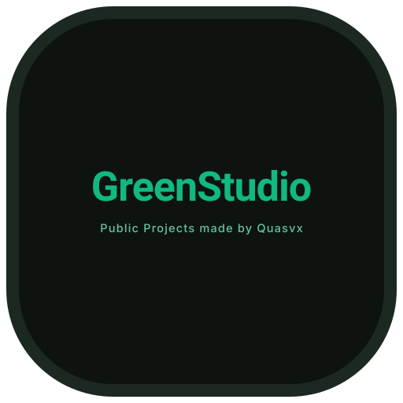

  

  # GreenStudio
  
<strong>Public Projects made by Quasvx</strong>

  

    
    
    
  

---

### 📌 About GreenStudio

**GreenStudio** is the central hub where I build, maintain, and publish open-source tools, modern web utilities, and serverless projects focused on performance, clean interfaces, and straightforward functionality.

---

### 📂 Featured Projects

| Project | Description | Status |
| :--- | :--- | :---: |
| *GreenShort*   | Url Shortening service that works with Workers AI, Analytics Engine and D1 SQLite Database. Only supports deploy to Cloudflare Pages. | `🟢 Active` |
| *D1GreenFiles* | Still working on it. The repo is still private till we make a stable release.               | `🟡 In Progress` |

---

### 🤝 Contributing

Contributions, bug reports, and suggestions are always welcome:

1. Fork the repository.
2. Create your feature branch (`git checkout -b feat/your-feature`).
3. Commit your changes (`git commit -m 'feat: add some feature'`).
4. Push to the branch (`git push origin feat/your-feature`).
5. Open a Pull Request.

---

  Designed and maintained by <b>Quasvx</b> • GreenStudio

